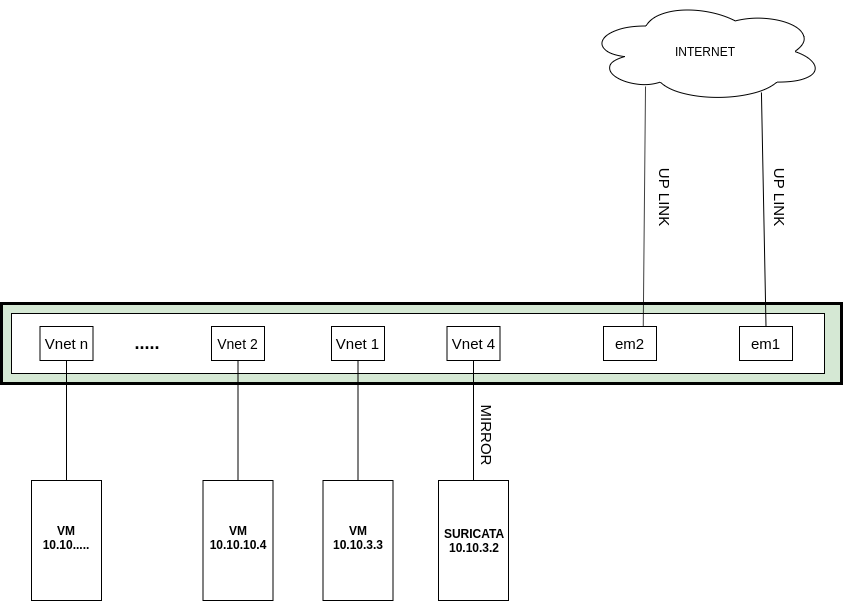

# Cài đặt suricata làm NIDS 

## Mô hình



Cài đặt suricata để giám sát traffic ra vào các VM trong KVM host.

Như mô hình trên KVM host có 2 interface vật lý là `em1` và `em2` được kết nối để ra ngòai internet. Mỗi interface này lại được cấu hình trunking gồm nhiều VLAN. Tại KVM host tạo các linux bridge tương ứng với các VLAN để các VM trong host kết nối được với VLAN này. Mỗi một VM được tạo trong host kết nối với bridge sẽ tạo ra một interface có tên là `vnetn`. Ở đây để có được tất cả traffic vào ra KVM host (vào ra các VM trong host) ta thực hiện mirror 2 interface `em1` và `em2` đến interface được kết nối với máy cài suricata (như mô hình trên là `vnet4` vì máy cài suricata trong mô hình này là một VM trong host KVM).

## Chuẩn bị

Một máy Centos7 có cấu hình tối thiểu:
 * 2G RAM
 * 2 core
 * 20G disk
 * 1 interface

## Cài đặt

Cài các gói cần thiết

```
yum -y install epel-release
yum -y install jq cargo openssl-devel PyYAML lz4-devel gcc libpcap-devel pcre-devel libyaml-devel file-devel zlib-devel jansson-devel nss-devel libcap-ng-devel libnet-devel tar make libnetfilter_queue-devel lua-devel wget perl
```

Download suricata

```
wget https://www.openinfosecfoundation.org/download/suricata-5.0.1.tar.gz
```

Install

```
tar xzvf suricata-5.0.1.tar.gz
cd suricata-5.0.1
./configure --libdir=/usr/lib64 --prefix=/usr --sysconfdir=/etc --localstatedir=/var --enable-nfqueue --enable-lua
make install-full
```

Kiểm tra

```
suricata -V
```

Nếu kết quả trả về như sau thì đã cài đặt thành công

```
This is Suricata version 5.0.1 RELEASE
```

## Cấu hình

Mở file `/etc/suricata/suricata.yaml` để sửa một số thông tin

Khai báo các dải LAN

```
HOME_NET: "[10.10.3.0/24. 10.10.10.0/24]"
EXTERNAL_NET: "!$HOME_NET"
```

Chỉ ra đường dẫn nơi lưu các rule

```
default-rule-path: /etc/suricata/rules
rule-files:
 - suricata.rules
```

Trong đó:
 * default-rule-path: là đường dẫn đến thư mục chứa các file rules của suricata
 * rule-files: khai báo các file chứa rules (nếu có nhiều file thì để nhiều dòng)

Tạo rule để kiểm tra

```
mkdir /etc/suricata/rules
touch suricata.rules
echo 'alert icmp any any -> any any (msg: "ICMP Packet found";)' > /etc/suricata/rules/suricata.rules
```

Bây giờ mở 2 terminal

Trên terminal thứ nhất chạy lệnh

```
suricata -c /etc/suricata/suricata.yaml -i eth0
```

`eth0` là tên interface có traffic đi qua(giống như tcpdump trên interface này)

Terminal thứ 2 chạy lệnh

```
tailf /var/log/suricata/fast.log
```

Bây giờ đứng từ một máy khác thực hiện lệnh ping đến máy cài suricata. Nếu trên terminal thứ 2 thấy có dòng log như sau thì việc cấu hình đã thành công

```
11/20/2019-18:02:51.951768  [**] [1:0:0] ICMP Packet found [**] [Classification: (null)] [Priority: 3] {ICMP} 10.10.3.1:8 -> 10.10.3.2:0
11/20/2019-18:02:51.951919  [**] [1:0:0] ICMP Packet found [**] [Classification: (null)] [Priority: 3] {ICMP} 10.10.3.2:0 -> 10.10.3.1:8
```

Nếu không muốn rules vừa tạo bạn vào lại file `/etc/suricata/rules/suricata.rules` để xóa rule vừa tạo

### Để suricata chạy như một chương trình deamon

```
cat <<EOF> /lib/systemd/system/suricata.service
[Unit]
Description=suricata NIDS Daemon
After=syslog.target network.target

[Service]
Type=simple
ExecStart=/usr/bin/suricata -c /etc/suricata/suricata.yaml -i eth0

[Install]
WantedBy=multi-user.target
EOF
```

Chạy suricata và cho phép khởi động cùng hệ thống

```
systemctl start suricata
systemctl enable suricata
```

### Cấu hình tự động update các rule mới nhất

Sử dụng Oinkmaster để thực hiện tự động update các rule của snort

Cài đặt oinkmaster

```
wget http://nchc.dl.sourceforge.net/project/oinkmaster/oinkmaster/2.0/oinkmaster-2.0.tar.gz
tar zxvf oinkmaster-2.0.tar.gz
cd oinkmaster-2.0
cp oinkmaster.pl /usr/local/bin/
chmod +x /usr/local/bin/oinkmaster.pl
cp oinkmaster.conf /etc/suricata/
```

Mở file `/etc/suricata/oinkmaster.conf` thêm vào dòng sau

```
url = http://rules.emergingthreats.net/open/suricata/emerging.rules.tar.gz
```


Chạy lệnh sau

```
oinkmaster.pl -C /etc/suricata/oinkmaster.conf -o /etc/suricata/rules
```

Kiểm tra các file rule mới được download

```
ls /etc/suricata/rules/*.rules
```

Khai báo các file này vào file `/etc/suricata/suricata.yaml`


Để update định kỳ ta thêm dòng sau vào file `/etc/crontab`

```
* * */1 * * root /usr/local/bin/oinkmaster.pl -C /etc/suricata/oinkmaster.conf -o /etc/suricata/rules
```

## Cấu hình mirror

Thực hiện mirror để traffic được copy đến interface kết nối với máy cài suricata để giám sát. Như mô hình trên ta thực hiện mirror để traffic qua 2 interface `em1` và `em2` đều được copy đến interface `vnet4` để đi vào `suricata` để phân tích.

### Với em1

```
tc qdisc add dev em1 ingress
tc filter add dev em1 parent ffff: protocol all u32 match u8 0 0 action mirred egress mirror dev vnet4
tc qdisc add dev em1 handle 1: root prio
tc filter add dev em1 parent 1: protocol all u32 match u8 0 0 action mirred egress mirror dev vnet4
```

### Với em2

```
tc qdisc add dev em2 ingress
tc filter add dev em2 parent ffff: protocol all u32 match u8 0 0 action mirred egress mirror dev vnet4
tc qdisc add dev em2 handle 1: root prio
tc filter add dev em2 parent 1: protocol all u32 match u8 0 0 action mirred egress mirror dev vnet4
```

### Up interface

```
ip link set vnet4 up
```

