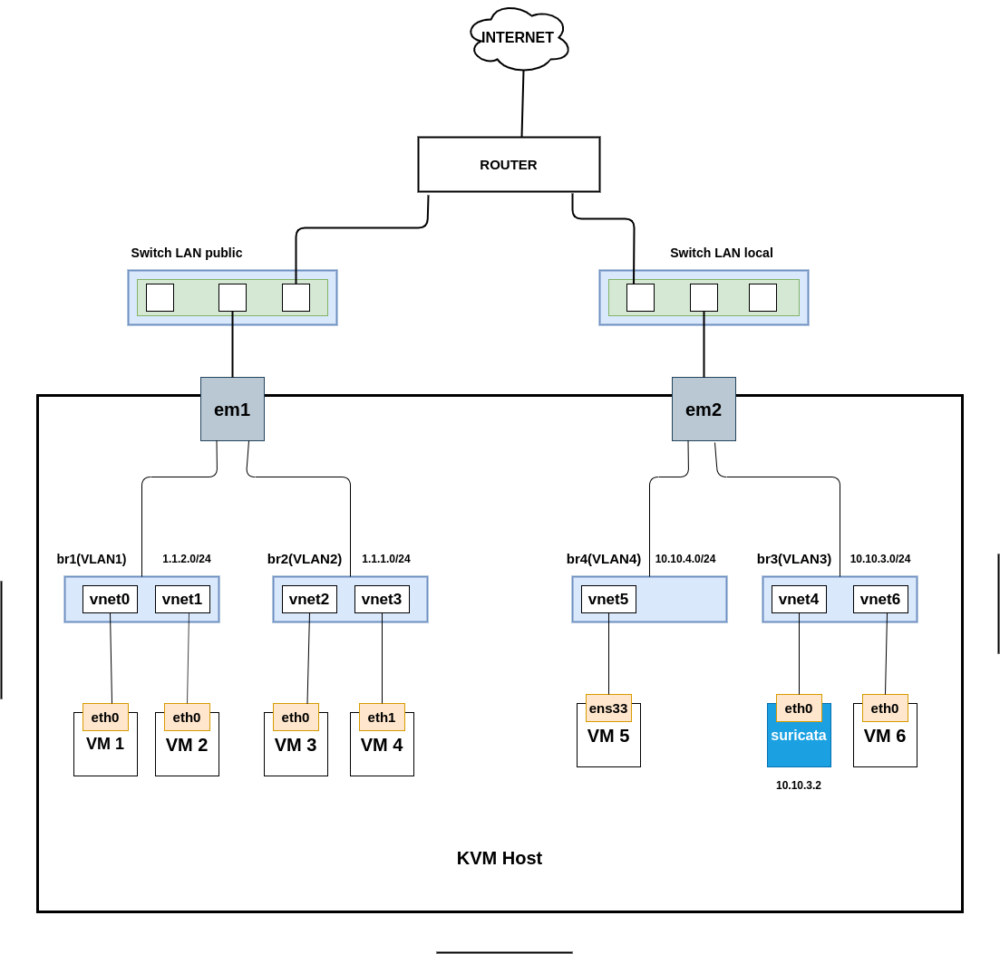
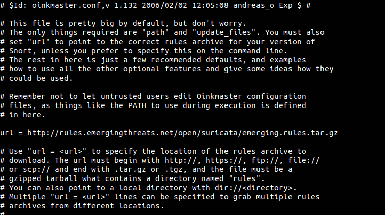
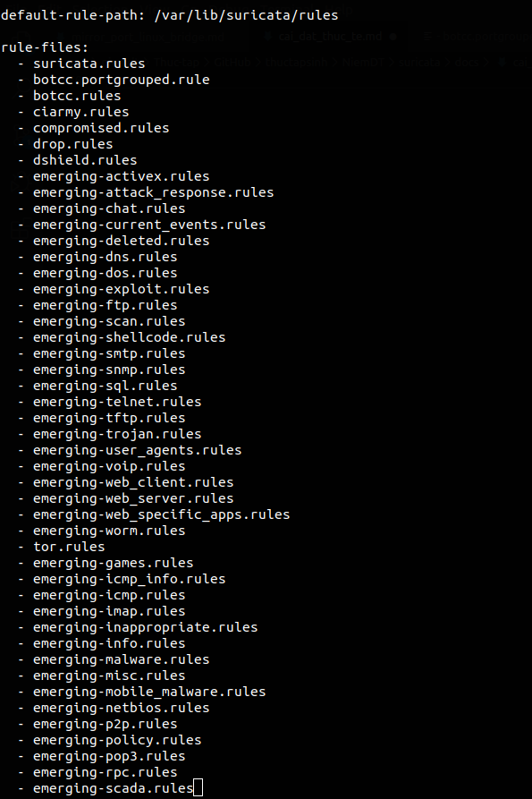

# Cài đặt suricata làm NIDS 

## Mô hình



## Phần 1: Cài đặt suricata

**Bước 1: Tạo máy**

Tạo một VM Centos7 trong KVM host có cấu hình tối thiểu như sau:

 * 2G RAM
 * 2 core
 * 20G disk
 * 1 interface kết nối đến linux bridge có thể ra được internet

**Bước 2: Cài đặt** 

Cài các gói cần thiết

```
yum -y install epel-release
yum -y install jq cargo openssl-devel PyYAML lz4-devel gcc libpcap-devel pcre-devel libyaml-devel file-devel zlib-devel jansson-devel nss-devel libcap-ng-devel libnet-devel tar make libnetfilter_queue-devel lua-devel wget perl
```

Download suricata

```
wget https://www.openinfosecfoundation.org/download/suricata-5.0.1.tar.gz
```

Install

```
tar xzvf suricata-5.0.1.tar.gz
cd suricata-5.0.1
./configure --libdir=/usr/lib64 --prefix=/usr --sysconfdir=/etc --localstatedir=/var --enable-nfqueue --enable-lua
make install-full
```

Kiểm tra

```
suricata -V
```

Nếu kết quả trả về như sau thì đã cài đặt thành công

```
This is Suricata version 5.0.1 RELEASE
```

**Bước 3: Cấu hình**

Mở file `/etc/suricata/suricata.yaml` để sửa một số thông tin

Khai báo các dải LAN

```
HOME_NET: "[10.10.3.0/24. 10.10.10.0/24]"
EXTERNAL_NET: "!$HOME_NET"
```

Chỉ ra đường dẫn nơi lưu các rule

```
default-rule-path: /etc/suricata/rules
rule-files:
 - suricata.rules
```

Trong đó:
 * default-rule-path: là đường dẫn đến thư mục chứa các file rules của suricata
 * rule-files: khai báo các file chứa rules (nếu có nhiều file thì để nhiều dòng)

Tạo rule để kiểm tra

```
mkdir /etc/suricata/rules
touch suricata.rules
echo 'alert icmp any any -> any any (msg: "ICMP Packet found";)' > /etc/suricata/rules/suricata.rules
```

Bây giờ mở 2 terminal

Trên terminal thứ nhất chạy lệnh

```
suricata -c /etc/suricata/suricata.yaml -i eth0
```

`eth0` là tên interface của suricata kết nối với vnet4

Terminal thứ 2 chạy lệnh

```
tailf /var/log/suricata/fast.log
```

Bây giờ đứng từ một máy khác thực hiện lệnh ping đến máy cài suricata. Nếu trên terminal thứ 2 thấy có dòng log như sau thì việc cấu hình đã thành công

```
11/20/2019-18:02:51.951768  [**] [1:0:0] ICMP Packet found [**] [Classification: (null)] [Priority: 3] {ICMP} 10.10.3.1:8 -> 10.10.3.2:0
11/20/2019-18:02:51.951919  [**] [1:0:0] ICMP Packet found [**] [Classification: (null)] [Priority: 3] {ICMP} 10.10.3.2:0 -> 10.10.3.1:8
```

**Bước 4: Đặt suricata chạy deamon**

```
cat <<EOF> /lib/systemd/system/suricata.service
[Unit]
Description=suricata NIDS Daemon
After=syslog.target network.target

[Service]
Type=simple
ExecStart=/usr/bin/suricata -c /etc/suricata/suricata.yaml -i eth0

[Install]
WantedBy=multi-user.target
EOF
```

Chạy suricata và cho phép khởi động cùng hệ thống

```
systemctl start suricata
systemctl enable suricata
```

**Bước 5: Cấu hình tự động update các rule mới nhất**

Sử dụng Oinkmaster để thực hiện tự động update các rule của snort

Cài đặt oinkmaster

```
wget http://nchc.dl.sourceforge.net/project/oinkmaster/oinkmaster/2.0/oinkmaster-2.0.tar.gz
tar zxvf oinkmaster-2.0.tar.gz
cd oinkmaster-2.0
cp oinkmaster.pl /usr/local/bin/
chmod +x /usr/local/bin/oinkmaster.pl
cp oinkmaster.conf /etc/suricata/
```

Mở file `/etc/suricata/oinkmaster.conf` thêm vào dòng sau

```
url = http://rules.emergingthreats.net/open/suricata/emerging.rules.tar.gz
```



Chạy lệnh sau

```
oinkmaster.pl -C /etc/suricata/oinkmaster.conf -o /etc/suricata/rules
```

Kiểm tra các file rule mới được download

```
ls /etc/suricata/rules/*.rules
```

Khai báo các file này vào file `/etc/suricata/suricata.yaml`



Để update định kỳ ta thêm dòng sau vào file `/etc/crontab`

```
* * */1 * * root /usr/local/bin/oinkmaster.pl -C /etc/suricata/oinkmaster.conf -o /etc/suricata/rules
```

## Phần 2: Cấu hình mirror

Bước này thao tác trên KVM host

Thực hiện mirror `em1` và `em2` đến `vnet4`

**Bước 1: Xác định vnet của VM cài suricata**

Địa chỉ MAC trên interface của VM và MAC trên vnet mà nó kết nối đến sẽ gần giống nhau. Nếu khác nhau chỉ khác nhau 8 bit đầu tiên

Kiểm tra trên VM cài suricata


Tìm vnet trên KVM host


**Bước 2: Mirror em1**

```
tc qdisc add dev em1 ingress
tc filter add dev em1 parent ffff: protocol all u32 match u8 0 0 action mirred egress mirror dev vnet4
tc qdisc add dev em1 handle 1: root prio
tc filter add dev em1 parent 1: protocol all u32 match u8 0 0 action mirred egress mirror dev vnet4
```

**Bước 3: Mirror em2**

```
tc qdisc add dev em2 ingress
tc filter add dev em2 parent ffff: protocol all u32 match u8 0 0 action mirred egress mirror dev vnet4
tc qdisc add dev em2 handle 1: root prio
tc filter add dev em2 parent 1: protocol all u32 match u8 0 0 action mirred egress mirror dev vnet4
```

**Bước 4: Up interface vnet4**

```
ip link set vnet4 up
```

## Phần 3: Kiểm tra

Trên máy cài suricata chạy lệnh sau

```
tailf /var/log/suricata/fast.log
```

Đứng từ một máy bên ngoài KVM host thực hiện ping đến một VM bất kỳ trong KVM host thấy log như sau xuất hiện là thành công

```
11/20/2019-18:02:51.951768  [**] [1:0:0] ICMP Packet found [**] [Classification: (null)] [Priority: 3] {ICMP} 10.10.3.1:8 -> 10.10.4.2:0
11/20/2019-18:02:51.951919  [**] [1:0:0] ICMP Packet found [**] [Classification: (null)] [Priority: 3] {ICMP} 10.10.4.2:0 -> 10.10.3.1:8
```
